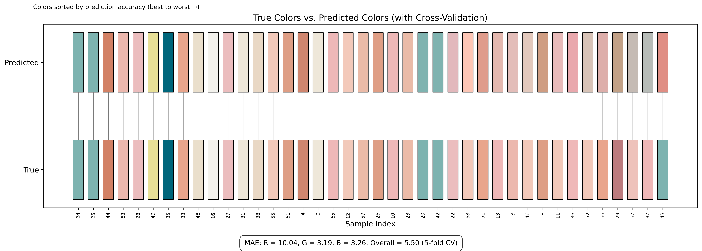
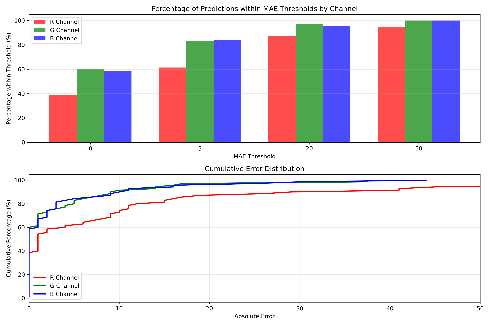
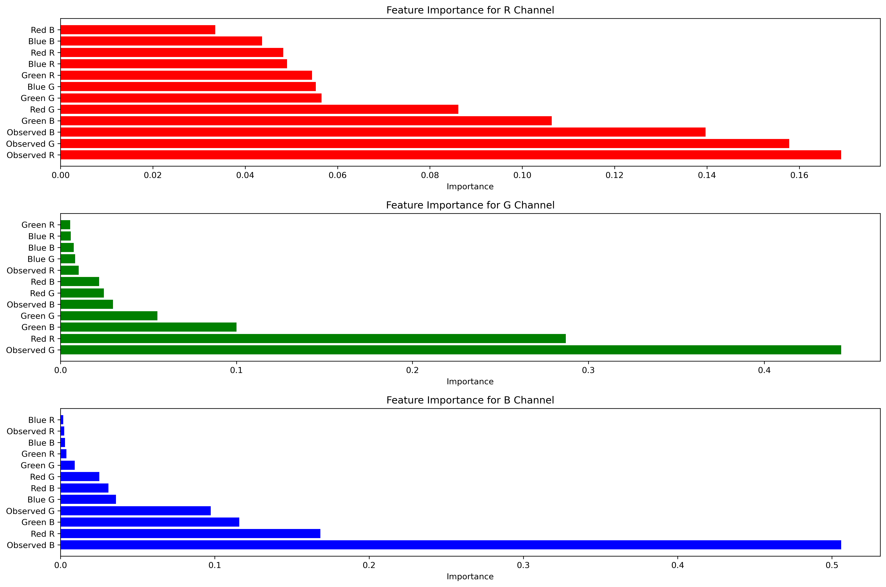

# Color Detection Tool Using Machine Learning

A machine learning-based color detection tool that accurately identifies photographed color samples and predicts RGB values despite varying lighting conditions.

## Overview

This tool achieves impressive results with:
- Mean absolute error (MAE): 5.50
- R² value: 0.854
- Mean absolute percentage error (MAPE): 3.02%

It offers a practical solution for color matching tasks without requiring physical color samples.

## Introduction

Color matching traditionally requires carrying physical samples to stores for comparison against color swatches. This project streamlines this process using modern camera sensors and machine learning.

The system uses a standardized color card with three reference shapes (red, green, blue) to detect and measure RGB values. It then adjusts the observed sample color to compensate for lighting conditions, returning a precisely calibrated RGB value.

## How It Works

1. **Data Collection**: Images containing both the standardized color card and color samples with known RGB values
2. **Image Processing**: YOLO-based visual recognition extracts RGB values from reference colors and samples
3. **Calibration**: XGBoost models predict true RGB values based on observed values and reference colors

## Results

The model shows varying performance across color channels:
- Red channel (more challenging): MAE = 10.04
- Green channel: MAE = 3.24
- Blue channel: MAE = 3.23

Over 76% of predictions fell within an acceptable margin of error (MAE = 5).

## Feature Importance

For all three models, the observed value of the respective channel was the most important feature, with varying degrees of contribution from other features.

## Technical Implementation

The system uses:
- **Algorithm**: Gradient boosted decision trees (XGBoost)
- **Features**: 12 dimensions (observed RGB values of sample + RGB values of three reference shapes)
- **Training**: Separate models for each RGB channel with 5-fold cross-validation
- **Metrics**: MAE, RMSE, R², MAPE, and Delta E

## Repository Contents

- `Filtering_analysis.ipynb`: Data cleaning and analysis notebook
- `Training_Evaluation.ipynb`: Model training and evaluation
- `Suinan_train_data_cleaned_cleaned.csv`: Processed dataset
- Various output visualization images

## Reference

Liu, P. (2025). Color_Calibration [Computer software]. GitHub. [https://github.com/jeffliulab/Color_Calibration](https://github.com/jeffliulab/Color_Calibration)
